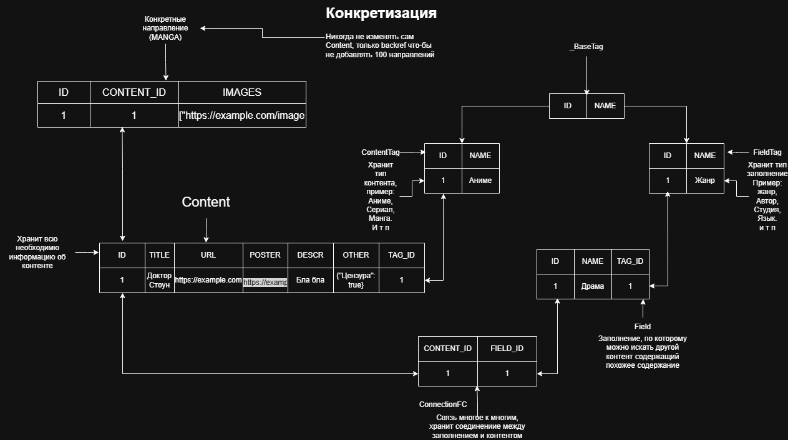

# DayLib-API — API для всего бэкенда

DayLib — это библиотека, где будут храниться все возможные типы развлечений: от книг, видео и постов до манги, музыки и многого другого контента.

## Какие есть плюсы у данного проекта?

- Проект имеет собственный фреймворк.
- Celery автоматически переносит задачу в Celery-воркер при заполнении стека.
- Гибкость: разработчику будет проще простого создать своего паука.
- Асинхронность на каждом шагу, поэтому проект сможет работать на слабых серверах.

# Быстрый старт

```bash
cp env.example .env
nano .env # Редактируем чувствительные параметры, такие как SECRET_KEY, SERVICE_KEY, ADMIN_LOGIN и т. д.
docker-compose up -d --build
```

## Какие могут быть трудности?

```bash
bash: ./entrypoint.sh: No such file or directory
```

Чтобы его исправить, пожалуйста, поменяйте CRLF на LF. Если проблема повторяется, попробуйте поменять `#!/bin/sh` на `#!/bin/bash`.

# Что такое сервисный ключ?

Вы могли заметить, что в `.env` есть сервисный ключ. Этот ключ нужен, чтобы ваши сервисы могли бесперебойно `долбить` по API без JWT или проверки на подлинность. Поэтому рекомендуемая длина — не менее 32 символов, чтобы перебор был бесполезен.

## Как создать сервисный ключ?

```bash
openssl rand -hex 32
```

После создания поменяйте в `.env` поле `SERVICE_KEY`.

## Как указать сервисный ключ при запросе к API?

Чтобы указать ваш ключ при запросе, просто подставьте в headers `Service-Token-WWW`.

```python
import requests

headers = {
    "accept": "application/json",
    "Service-Token-WWW": "YOUR-SERVICE-KEY",
}

response = requests.get("http://127.0.0.1:8000/api/v1/spider/status", headers=headers)
```

# Схема базы данных
Наша цель как можно сильнее обобщить схемы, что-бы не клепать 100+ схем по типу Genre, Author, Tag.
Была спроектирована `Гибкая EAV-модель с конкретизацией`


# Пауки
*Spider* (паук) в парсинге — это программа или модуль, который автоматически обходит сайт по ссылкам, скачивает страницы и обычно извлекает из них данные или новые ссылки. По-русски это чаще называют веб-краулер или паук.
Мой проект использует это определение для своих парсеров, так-как мы обходим весь сайт. И что-бы это было легко и просто я создал фреймворк который мог бы облегчить жизнь разработчику.

## Наш первый паук
[По данной ссылке](docs/SPIDER.md) вы увидите полный гайд как создать паука, как его настроить, какие есть возможности и некоторые хитрости, не захотел оставлять здесь по причине того что гайд вышел слишком длинным

## Что нас отличает от Scrapy
Вам может быть интересно а в чём интерес этого проекта, если это обычный парсер который будет хуже да и не поворотливее чем Scrapy?
Мой проект не позиционирует как полноценный фреймворк для парсинга, моя цель создать API с пауками для:
- Обработки данных
- Хранение данных
- Расспространение данных
- Управление пауками
- Гарантии отказоустойчивости


# Кто-нибудь, помогите?

Этому проекту нужны люди, которые могут наполнить [пауков](core/spider) своими любимыми сайтами и помочь в написании тестов для менеджеров и прочего. Также не помешало бы написать некий справочник для написания тестов. Как вы поняли, я в этом бездарен. Спасибо, что дочитали до конца!